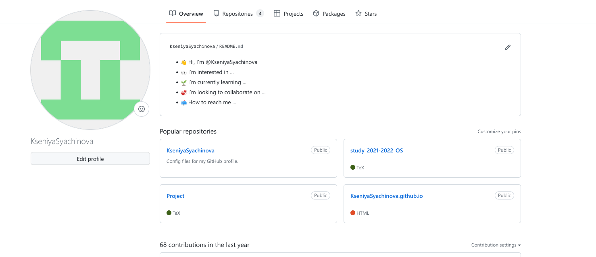
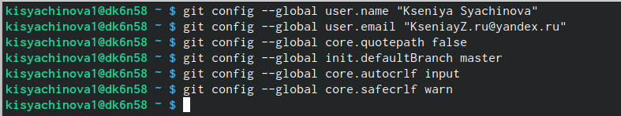
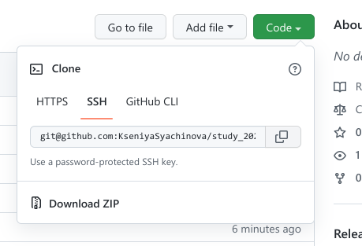
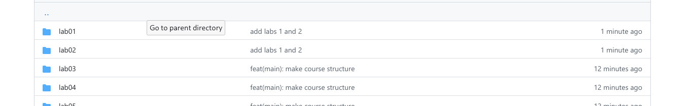

---
## Front matter
title: "Отчёт по лабораторной работе №3"
subtitle: "Компьютерые науки и технология программирования"
author: "Сячинова Ксения Ивановна"

## Generic otions
lang: ru-RU
toc-title: "Содержание"

## Bibliography
bibliography: bib/cite.bib
csl: pandoc/csl/gost-r-7-0-5-2008-numeric.csl

## Pdf output format
toc: true # Table of contents
toc-depth: 2
lof: true # List of figures
lot: true # List of tables
fontsize: 12pt
linestretch: 1.5
papersize: a4
documentclass: scrreprt
## I18n polyglossia
polyglossia-lang:
  name: russian
  options:
	- spelling=modern
	- babelshorthands=true
polyglossia-otherlangs:
  name: english
## I18n babel
babel-lang: russian
babel-otherlangs: english
## Fonts
mainfont: PT Serif
romanfont: PT Serif
sansfont: PT Sans
monofont: PT Mono
mainfontoptions: Ligatures=TeX
romanfontoptions: Ligatures=TeX
sansfontoptions: Ligatures=TeX,Scale=MatchLowercase
monofontoptions: Scale=MatchLowercase,Scale=0.9
## Biblatex
biblatex: true
biblio-style: "gost-numeric"
biblatexoptions:
  - parentracker=true
  - backend=biber
  - hyperref=auto
  - language=auto
  - autolang=other*
  - citestyle=gost-numeric
## Pandoc-crossref LaTeX customization
figureTitle: "Рис."
tableTitle: "Таблица"
listingTitle: "Листинг"
lofTitle: "Список иллюстраций"
lotTitle: "Список таблиц"
lolTitle: "Листинги"
## Misc options
indent: true
header-includes:
  - \usepackage{indentfirst}
  - \usepackage{float} # keep figures where there are in the text
  - \floatplacement{figure}{H} # keep figures where there are in the text
---

# Цель работы

Изучить идеологию применение средств контроля версий. Приобрести практические навыки по работе с системой git.

# Выполнение лабораторной работы

1. Создаём учётную запись на gitgub и заполянем необходиммые данные.

{ #fig:001 width=60% }

2. Далее произведём базовую настройку git. Первым делом сделаем предварительную конфигурацию git. Вводим команды, указывая имя и почту. 

{ #fig:002 width=60% }

 Затем, настроим utf-8 в выводе сообщений, зададим имя начальной ветки (master), параметр autocrlf и параметр safecrlf.

{ #fig:003 width=60% }

3. Создадим SSH ключ для последующей идентификации пользователя на сервере. Данная команда позволяет сгенерировать ключ: ssh-keygen -C "Имя Фамилия <workemail> "

{ #fig:004 width=60% }

Затем копируем ключ с помощью команды: cat ~/.ssh/id_rsa.pub | xclip - sel clip

{ #fig:00 width=60% }

Далее необходимо загрузить сгенерённый открытый ключ на github.

{ #fig:006 width=60% }

4. Для создания рабочего пространства и репозитория курса, создадим каталог для предмета «Архитектура компьютера». Обязательно будем придерживаться указанной структуре.

{ #fig:007 width=60% }

5. Наш репозиторий будет создан на основе шаблона: https://github.com/yam adharma/course-directory-student-template. Далее выбераем Use this template, далее задаём имя репозитория в форме study_2022–2023_arh-pc и создаём репозиторий.

{ #fig:008 width=60% }

{ #fig:009 width=60% }

После этого, приходим в каталог курса и клонируем данный репозиторий. Ссылку для клонирования копируем на странице созданного репозитория Code -> SS.

{ #fig:010 width=60% }

{ #fig:011 width=60% }

6. Настроим каталог курса, для этого проведём следующие действия: удаление ненужных файлов, создание необходимых каталогов и отправка файлов на сервер.

{ #fig:012 width=60% }

{ #fig:013 width=60% }

Проверяем правильность создания иерархии

{ #fig:014 width=60% }

# Задания для самостоятельной работы

1. После создания этого отчёта, загружаем его в определённую папку и выгружаем на github. Для этого используем определённую серию команд.

{ #fig:016 width=60% }

2. Аналогично поступаем с лабораторной №1 и №2.

{ #fig:015 width=60% }

3. Проверяем загрузку файлов. 

{ #fig:017 width=60% }

{ #fig:018 width=60% }

{ #fig:019 width=60% }

# Вывод

Я изучила идеологию и применение средств контроля версий. Также приобрела практические навыки по работе с системой git.

