---
## Front matter
title: "Отчёт по лабораторной работе №5"
subtitle: "Компьютерные науки и технология программирования"
author: "Сячинова Ксения Ивановна"

## Generic otions
lang: ru-RU
toc-title: "Содержание"

## Bibliography
bibliography: bib/cite.bib
csl: pandoc/csl/gost-r-7-0-5-2008-numeric.csl

## Pdf output format
toc: true # Table of contents
toc-depth: 2
lof: true # List of figures
lot: true # List of tables
fontsize: 12pt
linestretch: 1.5
papersize: a4
documentclass: scrreprt
## I18n polyglossia
polyglossia-lang:
  name: russian
  options:
	- spelling=modern
	- babelshorthands=true
polyglossia-otherlangs:
  name: english
## I18n babel
babel-lang: russian
babel-otherlangs: english
## Fonts
mainfont: PT Serif
romanfont: PT Serif
sansfont: PT Sans
monofont: PT Mono
mainfontoptions: Ligatures=TeX
romanfontoptions: Ligatures=TeX
sansfontoptions: Ligatures=TeX,Scale=MatchLowercase
monofontoptions: Scale=MatchLowercase,Scale=0.9
## Biblatex
biblatex: true
biblio-style: "gost-numeric"
biblatexoptions:
  - parentracker=true
  - backend=biber
  - hyperref=auto
  - language=auto
  - autolang=other*
  - citestyle=gost-numeric
## Pandoc-crossref LaTeX customization
figureTitle: "Рис."
tableTitle: "Таблица"
listingTitle: "Листинг"
lofTitle: "Список иллюстраций"
lotTitle: "Список таблиц"
lolTitle: "Листинги"
## Misc options
indent: true
header-includes:
  - \usepackage{indentfirst}
  - \usepackage{float} # keep figures where there are in the text
  - \floatplacement{figure}{H} # keep figures where there are in the text
---

# Цель работы

Освоение процедуры компиляции и сборки программ, написанных на ассемблере NASM.

# Выполнение лабораторной работы

1. Создаём каталог для работы с программами на языке ассемблера NASM и переходим в него.

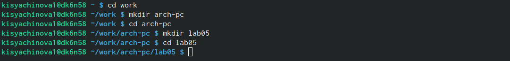{ #fig:001 width=70% }

Затем создаём тектовый файл с 'hello.asm' и открываем его с помощью тектового редактора 'gedit' 

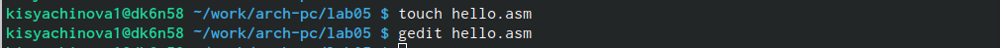{ #fig:002 width=70% }

Вводим следующий текст в текстовом документе. 

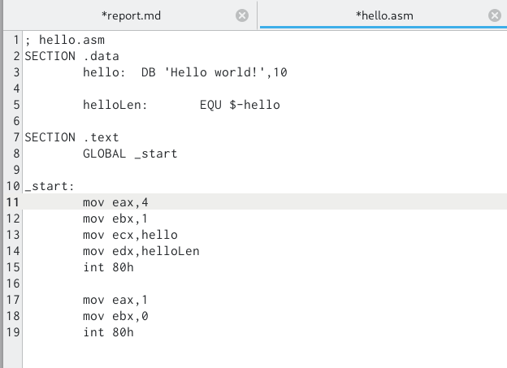{ #fig:003 width=50% }

2. После этого превращаем текст программы в объектный код. Для этого используем комнаду 'nasm -f elf hello.asm'. Объектный файл создан, т.к. текст написан без ошибок.Транслятор преобразовал объектный код, который был записан в файл 'hello.o' Проверяем это с помощью комнады 'ls'.

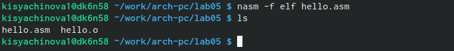{ #fig:004 width=70% }

3. После этого выполним следующую команду: 'nasm -o obj.o -f elf -g -l list.lst hello.asm'. Данная команда скомпилирует исходный файл в obj.o.Также, этой же командой создаётся файл 'list.lst' Команда 'ls' помогает нам проверить создание файлов.

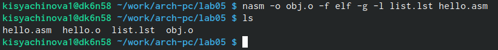{ #fig:005 width=70% }

Для более подробной информации может использовать команду 'man nasm'. 

{ #fig:006 width=75% }

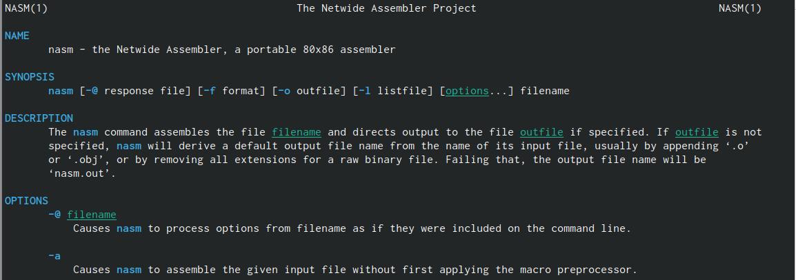{ #fig:007 width=60% }

Для получения списка форматов объектного файла используем 'nasm -hf'. 

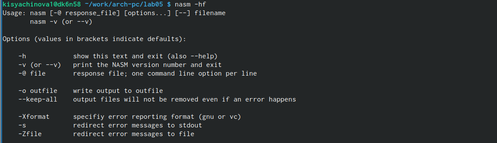{ #fig:008 width=60% }

4. Затем необходимо объектный файл передать на обработку компоновщику. Это можно делать с помощью команды 'ld -m elf_i386 hello.o -o hello'. Проверяем с помощью команды 'ls'.

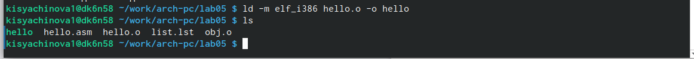{ #fig:009 width=70% }

Затем выполняем команду 'ld -m elf_i386 obj.o -o main'. Получаем сполняемый файл, который имеет название 'hello'. Объектный файл из которого собран этот исполняемый файл называется hello.o. 

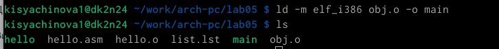{ #fig:010 width=70% }

Команда 'ld --help' позволяет нам увидеть формат командной строки LD. Для получения более подробной инфомрайии можно использовать команду 'man ld'. 

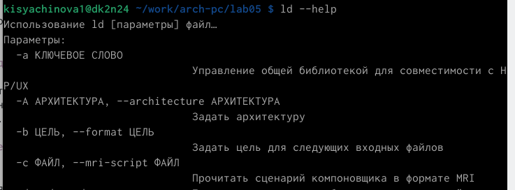{ #fig:011 width=60% }

{ #fig:012 width=70% }

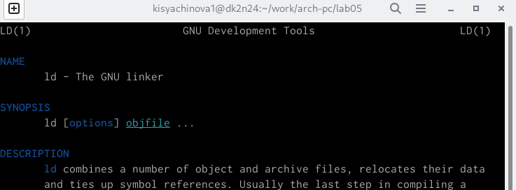{ #fig:013 width=60% }

5. Для запуска программы вводим в командной строке './hello'. Программа работает корректно.

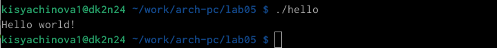{ #fig:014 width=60% }

# Задания для самостоятельной работы

1. В каталоге, созданном для лабораторной работы №5, создаём копию файла hello.asm с именем lab5.asm. Для этооо используем комнаду 'cp'. 

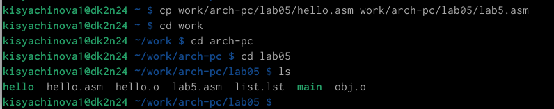{ #fig:015 width=60% }

2. Затем изменяем программу так, чтобы вместо "Hello world!" выводилась фамилия и имя. 

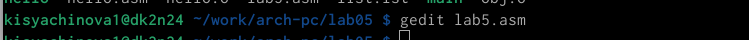{ #fig:016 width=70% }

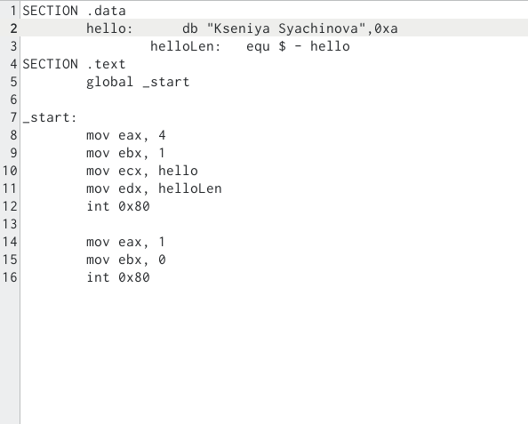{ #fig:017 width=60% }

3. Выполняем необходимые действия: трансляция в объектный файл, компоновка объектного файла. После этого запускаем нашу программу.

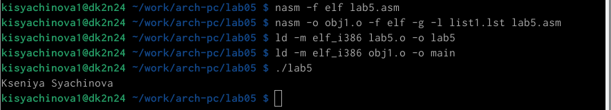{ #fig:018 width=60% }

# Выводы

В ходе выполнение данной лабораторной работы, я освоила процедуру компиляции и сборки программ, написанных на ассемблере NASM.
