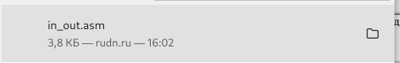

---
## Front matter
title: "Отчёт по лабораторной работе №6"
subtitle: "Компьютерные науки и технология программирвоания"
author: "Сячинова Ксения Ивановна"

## Generic otions
lang: ru-RU
toc-title: "Содержание"

## Bibliography
bibliography: bib/cite.bib
csl: pandoc/csl/gost-r-7-0-5-2008-numeric.csl

## Pdf output format
toc: true # Table of contents
toc-depth: 2
lof: true # List of figures
lot: true # List of tables
fontsize: 12pt
linestretch: 1.5
papersize: a4
documentclass: scrreprt
## I18n polyglossia
polyglossia-lang:
  name: russian
  options:
	- spelling=modern
	- babelshorthands=true
polyglossia-otherlangs:
  name: english
## I18n babel
babel-lang: russian
babel-otherlangs: english
## Fonts
mainfont: PT Serif
romanfont: PT Serif
sansfont: PT Sans
monofont: PT Mono
mainfontoptions: Ligatures=TeX
romanfontoptions: Ligatures=TeX
sansfontoptions: Ligatures=TeX,Scale=MatchLowercase
monofontoptions: Scale=MatchLowercase,Scale=0.9
## Biblatex
biblatex: true
biblio-style: "gost-numeric"
biblatexoptions:
  - parentracker=true
  - backend=biber
  - hyperref=auto
  - language=auto
  - autolang=other*
  - citestyle=gost-numeric
## Pandoc-crossref LaTeX customization
figureTitle: "Рис."
tableTitle: "Таблица"
listingTitle: "Листинг"
lofTitle: "Список иллюстраций"
lotTitle: "Список таблиц"
lolTitle: "Листинги"
## Misc options
indent: true
header-includes:
  - \usepackage{indentfirst}
  - \usepackage{float} # keep figures where there are in the text
  - \floatplacement{figure}{H} # keep figures where there are in the text
---

# Цель работы

Приобретение практических навыков работы в Midnight Commander. Освоение инструкций языка ассемблера mov и int.

# Выполнение лабораторной работы

1. Открываем Midnight Commander. (рис. [-@fig:001])

{ #fig:001 width=70% }

2. После этого переходим в каталог '~/work/arch-pc', который создали при выполнение лабораторной №5.(рис. [-@fig:002]),(рис. [-@fig:003])

{ #fig:002 width=70% }

{ #fig:003 width=70% }

3. После этого с помощью клавиши 'F7' создаём папку 'lab06' и переходим в неё.(рис. [-@fig:004])

{ #fig:004 width=70% }

4. Используя строку ввода создаём файл lab6-1.asm с помощью команды 'touch'. (рис. [-@fig:005])

{ #fig:005 width=70% }

5. После этого с помощью клавиши 'F4' открываем созданный файл для редактирования. У меня редактор 'mcedit'. (рис. [-@fig:006])

{ #fig:006 width=70% }

6. Вводим текст необходимой программы. Затем, сохраняем файл с помощью клавиши 'F2' и выходим из редактора с помощью клавиши 'F10'.(рис. [-@fig:007])

{ #fig:007 width=70% }

7.  С помощью клавиши 'F3', которая позволяем просмотреть файл, проверяем наличие текста.(рис. [-@fig:008])

{ #fig:008 width=70% }

8. После этого транслируем текст нашей программы в объектный файл, выполянем компоновку и запускаем. Результат: программа выводит "Введите строку", вводим ФИО. (рис. [-@fig:009])

{ #fig:009 width=70% }

9. Скачиваем файл 'in_out.asm' с ТУИСа. (рис. [-@fig:010])

{ #fig:010 width=70% }

10. Подключаемый файл должен лежать в том же каталоге, что и файл с программой, в которой он используется. С помощь. 'mc' перемещаем файл 'in_out.asm' Копируем с помощью клавиши 'F5'. (рис. [-@fig:011]), (рис. [-@fig:012])

{ #fig:011 width=70% }

{ #fig:012 width=70% }

11. Создаём копию файла 'lab6-1.asm' с именем 'lab6-2.asm' с помощью клавиши 'F6'. (рис. [-@fig:013])

{ #fig:013 width=70% }

12. Затем исправляем текст файла, и проверяем работу. 
(рис. [-@fig:014]),(рис. [-@fig:015])

{ #fig:014 width=60% }

{ #fig:015 width=60% }

13. Изменим в тексте программы 'sprintLF' на 'sprint'.(рис. [-@fig:016]), (рис. [-@fig:017])

{ #fig:016 width=70% }

{ #fig:017 width=70% }

Разница в том, что комнада 'sprintLF' позволяет нам делать ввод с клавиатуры в новой строке, в то время как команда 'sprint' делает это на одной строке

# Задания для самостоятельной работы.

1. Создаём копию файла lab6-1.asm. (рис. [-@fig:018])

{ #fig:018 width=70% }

Затем вносим изменение в программу, чтобы она работала по следющему режиму: 

- вывести приглашение типа “Введите строку:”;
- ввести строку с клавиатуры;
- вывести введённую строку на экран.(рис. [-@fig:019])

{ #fig:019 width=40% }

2. После этого транслируем текст нашей программы в объектный файл, выполянем компоновку и запускаем. Программа просить ввести строку и выводит её. (рис. [-@fig:020])

{ #fig:020 width=70% }

3. Аналогично создаём копию файла lab6-2.asm (рис. [-@fig:021])

{ #fig:021 width=70% }

Изменяем файл, чтобы он работал по такому же алгоритму, при этом используем подпрограмму из внешнего файла in_out.asm.(рис. [-@fig:022])

{ #fig:022 width=40% }

4. Компилируем и запускаем файл.(рис. [-@fig:023])

{ #fig:023 width=70% }

# Выводы

В ходе выполнения данной лабораторной работы я приобрела практические навыки работы в Midnight Commander, а также освоила
инструкцию языка ассемблера mov и int.
