---
## Front matter
title: "Отчёт по лабораторной работе №7"
subtitle: "Компьютерные науки и технология программирования"
author: "Сячинова Ксения Ивановна"

## Generic otions
lang: ru-RU
toc-title: "Содержание"

## Bibliography
bibliography: bib/cite.bib
csl: pandoc/csl/gost-r-7-0-5-2008-numeric.csl

## Pdf output format
toc: true # Table of contents
toc-depth: 2
lof: true # List of figures
lot: true # List of tables
fontsize: 12pt
linestretch: 1.5
papersize: a4
documentclass: scrreprt
## I18n polyglossia
polyglossia-lang:
  name: russian
  options:
	- spelling=modern
	- babelshorthands=true
polyglossia-otherlangs:
  name: english
## I18n babel
babel-lang: russian
babel-otherlangs: english
## Fonts
mainfont: PT Serif
romanfont: PT Serif
sansfont: PT Sans
monofont: PT Mono
mainfontoptions: Ligatures=TeX
romanfontoptions: Ligatures=TeX
sansfontoptions: Ligatures=TeX,Scale=MatchLowercase
monofontoptions: Scale=MatchLowercase,Scale=0.9
## Biblatex
biblatex: true
biblio-style: "gost-numeric"
biblatexoptions:
  - parentracker=true
  - backend=biber
  - hyperref=auto
  - language=auto
  - autolang=other*
  - citestyle=gost-numeric
## Pandoc-crossref LaTeX customization
figureTitle: "Рис."
tableTitle: "Таблица"
listingTitle: "Листинг"
lofTitle: "Список иллюстраций"
lotTitle: "Список таблиц"
lolTitle: "Листинги"
## Misc options
indent: true
header-includes:
  - \usepackage{indentfirst}
  - \usepackage{float} # keep figures where there are in the text
  - \floatplacement{figure}{H} # keep figures where there are in the text
---

# Цель работы

Освоить арифметические инструкции языка ассемблера NASM.

# Выполнение лабораторной работы

1. Создаём каталог для программ данной лабораторной работы, создаём необходимый файл.(рис. [-@fig:001])

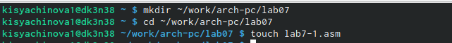{ #fig:001 width=70% }

2. Затем открываем файл и вводим необходимый текст программы.(рис. [-@fig:002]), (рис. [-@fig:003])

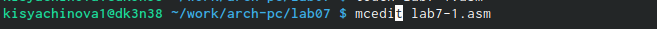{ #fig:002 width=70% }

{ #fig:003 width=40% }

Затем производим компиляцию файла и запускаем его. Не забываем поместить файл 'in_out.asm' в этот каталог. (рис. [-@fig:004])

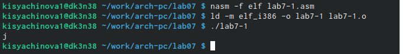{ #fig:004 width=70% }

Вместо 10 в данном случае у нас выводится 'j'. Дело в том, что код символа '6' равен 00110110 в двоичном представлении, код символа '4' равен 00110100. Команда складывает эти коды и получается 01101010, что в свою очередб является кодом символа 'j'.

3. Изменим пару строк в программе. (рис. [-@fig:005]),(рис. [-@fig:006])

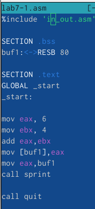{ #fig:005 width=40% }

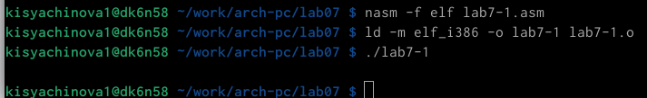{ #fig:006 width=70% }

После запуска программы видим, что символ не отображается на экране. Согласно таблице ASCII имеем символ 'STX'.

4. Создаём файл 'lab7-2.asm' и открываем его.(рис. [-@fig:007])

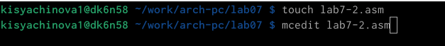{ #fig:007 width=70% }

Пишем листинг программы. (рис. [-@fig:008])

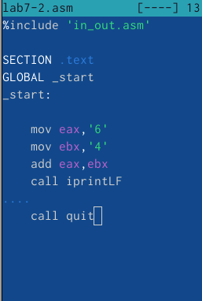{ #fig:008 width=40% }

В результате мы получаем число 6, так как команда add складываем коды символов. Однако комнада'iprintLF' позволяет вывести именно число, а не символ, кодом которого является это число.

5. Аналогично заменим символы на числа. Заменим определённые строки, запустим файл.(рис. [-@fig:009]),(рис. [-@fig:010])

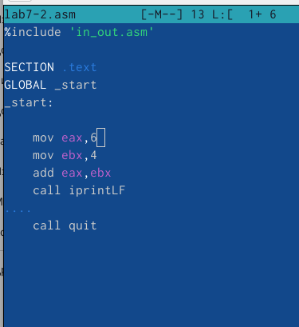{ #fig:009 width=40% }

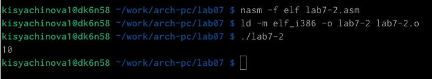{ #fig:010 width=70% }
 
В резутальтате получили число 10. При изменении 'ipfintLF' на 'iprint' результат не выводится на новую строку(рис. [-@fig:011])

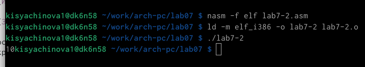{ #fig:011 width=70% }

6. Создаем файл 'lab7-3.asm' и вводим текст программы. Данная программа позволяет вычислять значения выражения 𝑓(𝑥) = (4 ∗ 6 + 2)/5.(рис. [-@fig:012]) (рис. [-@fig:013]), (рис. [-@fig:014])

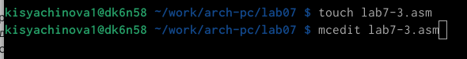{ #fig:012 width=70% }

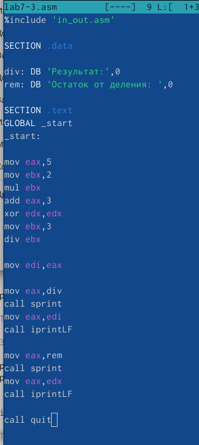{ #fig:013 width=40% }

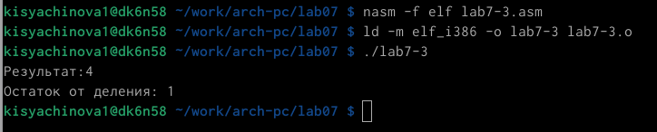{ #fig:014 width=70% }

7. Рассмотрим ещё одну программу, которая позволит определить вариант с помощью номера студенческого билета. Для этого создаём файл, пишем программу и запускаем её. (рис. [-@fig:015]), (рис. [-@fig:016]), (рис. [-@fig:017])

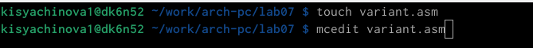{ #fig:015 width=70% }

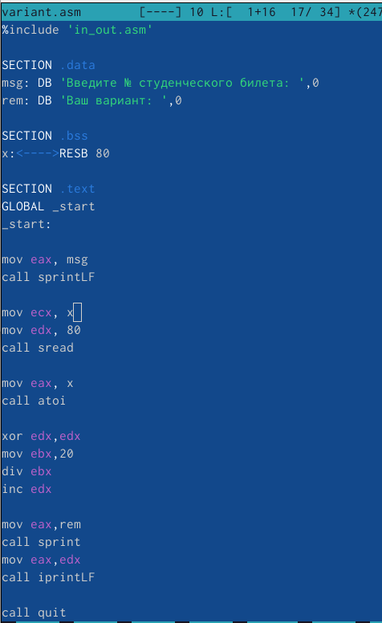{ #fig:016 width=40% }

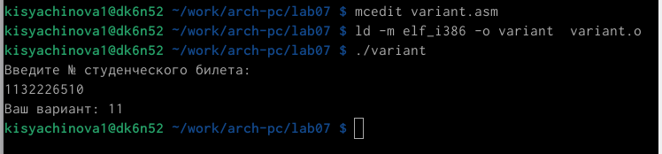{ #fig:017 width=70% }

Результат: мой вариант №11.

- Ответы на вопросы:
1. Какие строки листинга 7.4 отвечают за вывод на экран сообщения ‘Ваш вариант:’? - 
2. 
3. 
4. 
5. 
6. 
7. 

# Задание для самостоятельной работы

1. Нужно написать программу для выражения 'f(x)=10(𝑥 + 1) − 10' (вариант 11). При значениях 'x1=1', 'x2=7'.

Для начала создадим файл, в котором напишем код программы и откроем его. (рис. [-@fig:018])

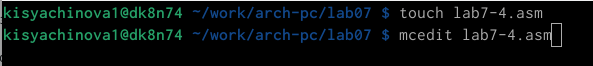{ #fig:018 width=70% }

После вводим текст программы. (рис. [-@fig:019]), (рис. [-@fig:020])

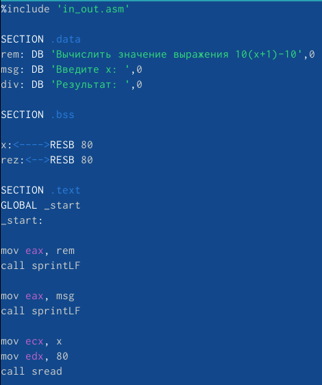{ #fig:019 width=45% }

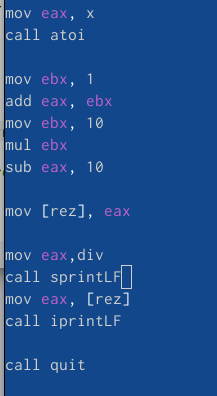{ #fig:020 width=30% }

После этого проводим компиляцию файла и проверяем выполнение работы. Всё верно. (рис. [-@fig:021])

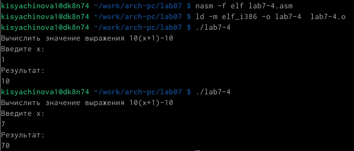{ #fig:021 width=70% }

# Выводы

В ходе выполнения данной лабораторной работы я освоила арифметические инструкции языка ассемблера NASM.
