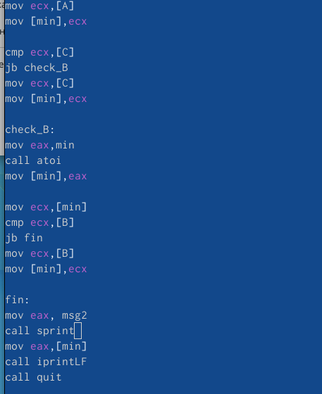

---
## Front matter
title: "Отчёт по лабораторной рабоет №8"
subtitle: "Компьтерные науки и технология программирования"
author: "Сячинова Ксения Ивановна"

## Generic otions
lang: ru-RU
toc-title: "Содержание"

## Bibliography
bibliography: bib/cite.bib
csl: pandoc/csl/gost-r-7-0-5-2008-numeric.csl

## Pdf output format
toc: true # Table of contents
toc-depth: 2
lof: true # List of figures
lot: true # List of tables
fontsize: 12pt
linestretch: 1.5
papersize: a4
documentclass: scrreprt
## I18n polyglossia
polyglossia-lang:
  name: russian
  options:
	- spelling=modern
	- babelshorthands=true
polyglossia-otherlangs:
  name: english
## I18n babel
babel-lang: russian
babel-otherlangs: english
## Fonts
mainfont: PT Serif
romanfont: PT Serif
sansfont: PT Sans
monofont: PT Mono
mainfontoptions: Ligatures=TeX
romanfontoptions: Ligatures=TeX
sansfontoptions: Ligatures=TeX,Scale=MatchLowercase
monofontoptions: Scale=MatchLowercase,Scale=0.9
## Biblatex
biblatex: true
biblio-style: "gost-numeric"
biblatexoptions:
  - parentracker=true
  - backend=biber
  - hyperref=auto
  - language=auto
  - autolang=other*
  - citestyle=gost-numeric
## Pandoc-crossref LaTeX customization
figureTitle: "Рис."
tableTitle: "Таблица"
listingTitle: "Листинг"
lofTitle: "Список иллюстраций"
lotTitle: "Список таблиц"
lolTitle: "Листинги"
## Misc options
indent: true
header-includes:
  - \usepackage{indentfirst}
  - \usepackage{float} # keep figures where there are in the text
  - \floatplacement{figure}{H} # keep figures where there are in the text
---

# Цель работы

Изучить команды условного и безусловного перехода. Приобрести навыки написания программ с использованием переходов, а так же знакомство с назначением и структурой файла листинга.

# Выполнение лабораторной работы

1. Создаём каталог для программ лабораторной работы №8, переходим в него и создаём файл 'lab8-1.asm'.(рис. [-@fig:001])

{ #fig:001 width=70% }

2. Рассмотрим пример программы, открываем файл и вводим текст программы.(рис. [-@fig:002]), (рис. [-@fig:003])

{ #fig:002 width=50% }

{ #fig:003 width=70% }

Команда 'jmp' позволяет начать использование инструкции с отмеченной метки, в нашем случае с '_label2'.

Изменим программу так, чтобы она выводила сначала ‘Сообщение №2’, потом ‘Сообщение №1’ и завершала работу.(рис. [-@fig:004]), (рис. [-@fig:005])

{ #fig:004 width=50% }

{ #fig:005 width=70% }

Затем, изменим программу так, чтобы сообщения выводились в обратном порядке. Программы рабоатет корректно. (рис. [-@fig:006]), (рис. [-@fig:007])

{ #fig:006 width=50% }

{ #fig:007 width=70% }

3. Создадим файл 'lab8-2.asm' и вводим текст программы.(рис. [-@fig:008]), (рис. [-@fig:009]), (рис. [-@fig:010]),(рис. [-@fig:011])

{ #fig:008 width=70% }

{ #fig:009 width=50% }

{ #fig:010 width=50% }

{ #fig:011 width=70% }

4. Для получения файл листинга указывает ключ '-l'. Создадим файл листинга для программы из файла 'lab8-2.asm'. и откроем его с помощью текстового редактора.(рис. [-@fig:012])

{ #fig:012 width=70% }

Объясним содержимое трёх строк файла.

1) 24 - номер строки файла листинга, 00000106 - смещение машинного кода от начала текущего сегмента, E891FFFFFF - машинный код, в который ассеблируется данная инструкция в вие шестнадцатиричной последовательности, call atoi - исходная строка программы.(рис. [-@fig:013])

{ #fig:013 width=70% }

2) 47 - номер строка файла листинга, 00000159 - смещение машинного кода от начала текущего сегмента, 'В8[13000000]' - машинный код, в который ассеблируется данная инструкция в вие шестнадцатиричной последовательности, 'mov eax,msg1' - исходная строка программы. (рис. [-@fig:014])

{ #fig:014 width=70% }

3) 20 - номер строка файла листинга, 000000F7 - смещение машинного кода от начала текущего сегмента, 'ВA0A000000' - машинный код, в который ассеблируется данная инструкция в вие шестнадцатиричной последовательности, 'mov edx,10' - исходная строка программы. (рис. [-@fig:015])

{ #fig:015 width=70% }

Удалим один операнд в программе, выполним трансляцию с получением файла. В файле листинга нам также выдаёт ошибку.
(рис. [-@fig:016])

{ #fig:016 width=70% }

# Задание для самостоятельной работы

1. Напишем программу для нахождения наименьшей из 3 целочисленных переменных a, b и c. В соответсвии с лабораторной вариантом №7 мой вариант 11. Числа A=21, B=28, C=34 (рис. [-@fig:017]), (рис. [-@fig:018]),(рис. [-@fig:019]),,(рис. [-@fig:020]),

{ #fig:017 width=70% }

{ #fig:018 width=50% }

{ #fig:019 width=50% }

{ #fig:020 width=70% }

2. Напишем программу, которая для введённых значений 'x' и 'a' вычисляет значение заданной функции. Согласно лабораторной №7, мой вариант 11. Тогда имеем систему рис. [-@fig:021]. Проверим её с помощью значений (0;3) и (1;2)

{ #fig:021 width=70% }

{ #fig:022 width=70% }

{ #fig:023 width=50% }

{ #fig:024 width=50% }

Программа выдаёт верный результат. При (0;3) имеем значение выражение равное 12, в при (1;2) равное 9.(рис. [-@fig:025]),

{ #fig:025 width=70% }

#Вывод

В ходе выполнения данной лабораторной работы я изучила команды условного и безусловного перехода. Преобрела навыки по написанию программ с использованием переходов. Так же познакомилась с назначением и структурой файла листинга
