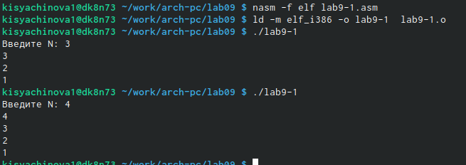

---
## Front matter
title: "Отчёт по лабораторной работе №9"
subtitle: "Компьютерные науки и технология программирования"
author: "Сячинова Ксения Ивановна"

## Generic otions
lang: ru-RU
toc-title: "Содержание"

## Bibliography
bibliography: bib/cite.bib
csl: pandoc/csl/gost-r-7-0-5-2008-numeric.csl

## Pdf output format
toc: true # Table of contents
toc-depth: 2
lof: true # List of figures
lot: true # List of tables
fontsize: 12pt
linestretch: 1.5
papersize: a4
documentclass: scrreprt
## I18n polyglossia
polyglossia-lang:
  name: russian
  options:
	- spelling=modern
	- babelshorthands=true
polyglossia-otherlangs:
  name: english
## I18n babel
babel-lang: russian
babel-otherlangs: english
## Fonts
mainfont: PT Serif
romanfont: PT Serif
sansfont: PT Sans
monofont: PT Mono
mainfontoptions: Ligatures=TeX
romanfontoptions: Ligatures=TeX
sansfontoptions: Ligatures=TeX,Scale=MatchLowercase
monofontoptions: Scale=MatchLowercase,Scale=0.9
## Biblatex
biblatex: true
biblio-style: "gost-numeric"
biblatexoptions:
  - parentracker=true
  - backend=biber
  - hyperref=auto
  - language=auto
  - autolang=other*
  - citestyle=gost-numeric
## Pandoc-crossref LaTeX customization
figureTitle: "Рис."
tableTitle: "Таблица"
listingTitle: "Листинг"
lofTitle: "Список иллюстраций"
lotTitle: "Список таблиц"
lolTitle: "Листинги"
## Misc options
indent: true
header-includes:
  - \usepackage{indentfirst}
  - \usepackage{float} # keep figures where there are in the text
  - \floatplacement{figure}{H} # keep figures where there are in the text
---

# Цель работы

Приобрести навыки написания программ с использованием циклов и обработкой аргументов командной строки.

# Выполнение лабораторной работы

1. Создаём каталог для программ лабораторных №9, переходим в него и создаём файл 'lab9-1.asm'. Открываем его.(рис. [-@fig:001])

{ #fig:001 width=70% }

Вводим текст программы. (рис. [-@fig:002]), 

{ #fig:002 width=40% }

Создаём исполняемый файл и проверяем работу. Я проверила работу для N=3, N=4. (рис. [-@fig:003])

{ #fig:003 width=70% }

Изменим значение регистра в 'ecx' в цикле.(рис. [-@fig:004])

{ #fig:004 width=40% }

Данный пример показывает, что использование регистра 'ecx' в теле цикла 'loop' может привести к некорректной работе программы.(рис. [-@fig:005])

{ #fig:005 width=60% }

Программа работает некорректно. Регистр 'ecx' принмает бесконечное количество значений. Число проходов цикла не соответствует числу N.

Для использование регистра 'ecx' в цикле и сохранения корректности работы испольует стек. Вносим изменения в программу, где добавим команды 'push' и 'pop'. (рис. [-@fig:006])

{ #fig:006 width=40% }

Файл работает корректно, в данном случае число проходов цикла соответствуют значению N.(рис. [-@fig:007])

{ #fig:007 width=60% }

2. Создадим файл 'lab9-2.asm', откроем его и введём текст программы. (рис. [-@fig:008]), (рис. [-@fig:009])

{ #fig:008 width=70% }

{ #fig:009 width=40% }

В результате все введённые агрументы обрабатываются. (рис. [-@fig:010])

{ #fig:010 width=60% }

Рассмотрим программу, которая выводит сумму чисел. Для этого создадим новый файд 'lab9-3.asm', откроем его и введём текст программы.(рис. [-@fig:011]), (рис. [-@fig:012])

{ #fig:011 width=70% }

{ #fig:012 width=40% }

Программа работает корректно. (рис. [-@fig:013])

{ #fig:013 width=60% }

Изменим программу так, чтобы программа выводила произведение чисел, которые передаются в программу как аргументы. (рис. [-@fig:014]), (рис. [-@fig:015])

{ #fig:014 width=50% }

{ #fig:015 width=70% }

#Самостоятельная работа

Напишем программу, которая находит сумму занчений функций f(x) для x=x1,x2,...,xn. Программа будет выводить значение f(x1)+f(x2)+...+f(xn). В соответсвии с вариантом 11 имеем f(x)=15x-9. (рис. [-@fig:016])

{ #fig:016 width=35% }

Программа работает корректно при заданных значениях. (рис. [-@fig:017])

{ #fig:017 width=60% }

# Выводы

В ходе выполнения данной лабораторной работы я приобрела навыки написания программ с использованием циклов и обработкой аргументов командной строки

