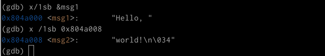
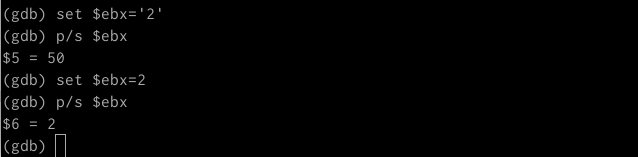
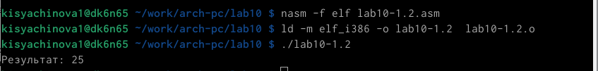

---
## Front matter
title: "Отчёт по лабораторной работе №10"
subtitle: "Компьютерные науки и технология программирования"
author: "Сячинова Ксения Ивановна"

## Generic otions
lang: ru-RU
toc-title: "Содержание"

## Bibliography
bibliography: bib/cite.bib
csl: pandoc/csl/gost-r-7-0-5-2008-numeric.csl

## Pdf output format
toc: true # Table of contents
toc-depth: 2
lof: true # List of figures
lot: true # List of tables
fontsize: 12pt
linestretch: 1.5
papersize: a4
documentclass: scrreprt
## I18n polyglossia
polyglossia-lang:
  name: russian
  options:
	- spelling=modern
	- babelshorthands=true
polyglossia-otherlangs:
  name: english
## I18n babel
babel-lang: russian
babel-otherlangs: english
## Fonts
mainfont: PT Serif
romanfont: PT Serif
sansfont: PT Sans
monofont: PT Mono
mainfontoptions: Ligatures=TeX
romanfontoptions: Ligatures=TeX
sansfontoptions: Ligatures=TeX,Scale=MatchLowercase
monofontoptions: Scale=MatchLowercase,Scale=0.9
## Biblatex
biblatex: true
biblio-style: "gost-numeric"
biblatexoptions:
  - parentracker=true
  - backend=biber
  - hyperref=auto
  - language=auto
  - autolang=other*
  - citestyle=gost-numeric
## Pandoc-crossref LaTeX customization
figureTitle: "Рис."
tableTitle: "Таблица"
listingTitle: "Листинг"
lofTitle: "Список иллюстраций"
lotTitle: "Список таблиц"
lolTitle: "Листинги"
## Misc options
indent: true
header-includes:
  - \usepackage{indentfirst}
  - \usepackage{float} # keep figures where there are in the text
  - \floatplacement{figure}{H} # keep figures where there are in the text
---

# Цель работы

Приобрести навыки написания программ с использованием подпрограмм. познакомиться с методами отладки при помощи GDB и его основными возможностями.

# Выполнение лабораторной работы

1. Создаём каталог для выполнения лабораторной работы. Переходим в него и создаём файл для первого листинга.(рис. [-@fig:001])

{ #fig:001 width=70% }

2. Рассмотрим программу вычисления арифмитических выражения с помощью подпрограммы '_calcul'. (рис. [-@fig:002]), (рис. [-@fig:003])

{ #fig:002 width=30% }

{ #fig:003 width=60% }

3. Изменим программу, при этом добавим подпрограмму g(x)=3x-1. (рис. [-@fig:004]), (рис. [-@fig:005]), (рис. [-@fig:006])

{ #fig:004 width=60% }

{ #fig:005 width=60% }

{ #fig:006 width=60% }

Программа работает корректно. При х=1 имеем, что g(x)=2, а f(x)=11.

4. Создаём файл для второго листинга. Напишем программу печати сообщения Hello world!. (рис. [-@fig:007]), (рис. [-@fig:008])

{ #fig:007 width=60% }

{ #fig:008 width=30% }

Затем получаем исполняемый файл. Для работы с GDB нужно добавить отладочную информация, для этого трансляцию программы необходимо проводить с ключом "-g". Загружаем исполняемый файл в отладчик. (рис. [-@fig:009])

{ #fig:009 width=60% }

Проверим работу программы, запускаем её в оболочке GDB с помощью комнады 'run'.  (рис. [-@fig:010])

{ #fig:010 width=60% }

Затем установим брейкпоинт на метку _start, с которой начинается выполнение программы и запусим её. (рис. [-@fig:011])

{ #fig:011 width=60% }

Далее просмотрим дисассимблированный код программы с помощью команды disassemble начиная с метки _start. (рис. [-@fig:012])

{ #fig:012 width=60% }

Переключимся на отображение команд с Intel'овским синтаксисом с помощью команды set disassembly-flavor intel. (рис. [-@fig:013])

{ #fig:013 width=60% }

Для более удобного анализа программы включаем режим псевдографики.(рис. [-@fig:014])

{ #fig:014 width=60% }

В этом режиме имеем три окна: 
- В верхней части названия регистров и их текущее значения
- В среденй части виден результат дисассимилирования программы
- Нижняя часть доступная для ввода команд

Основные различия синтаксиса машинных команд в режимах ATT и Intel заключаются в том, что в синтаксисе Intel не используются символы $ и %, а так же операнды меняются местами.

5. Для проверки точек останова используем команду 'info breakpoints'. (рис. [-@fig:015])

{ #fig:015 width=60% }

Установим ещё одну точку останова по адресу интрукции (ebx, 0x0). (рис. [-@fig:016])

{ #fig:016 width=60% }

{ #fig:017 width=60% }

6. Выполним 5 инструкций с помощью команды "stepi" и проследим значение регистров.(рис. [-@fig:018]). Как мы можем заметить, изменяются значения регистров eax, ebx, ecx, edx.

{ #fig:018 width=60% }

Команда 'info registers' (i r) позволяет посмтреть содержимое регистров. (рис. [-@fig:019])

{ #fig:019 width=60% }

Команду 'x <адрес>' можно использовать для отображения памяти. С помощью 'x &<имя переменной>' так же можно это сделать.(рис. [-@fig:020])

{ #fig:020 width=60% }
 
Далее воспользуемся комнадой 'sПриобрести навыки написания программ с использованием подпрограмм. познакомиться с методами отладки при помощи GDB и его основными возможностями.et', которая помогает изменить значение для регистра и ячейки. (рис. [-@fig:021]), (рис. [-@fig:022])

{ #fig:021 width=60% }

{ #fig:022 width=60% }

Для просмотра значений используем команду 'print /F <val>'. (рис. [-@fig:023])

{ #fig:023 width=60% }

С помощью команды 'set' можем изменить значение регистра. Изменим значения регистра 'ebx'. (рис. [-@fig:024])

{ #fig:024 width=60% }

Основное различие в том, что код символа '2' - 110010, а это есть число 50.

Завершим выполнение программы с помощью команды 'continue' и выйдем из отдладчика с помощью команды 'q'. (рис. [-@fig:025])

{ #fig:025 width=60% }

7. Копируем файл из лабораторной работы №9 с новым именем.(рис. [-@fig:026]) 

{ #fig:026 width=60% }

Далее создаём имполняемый файл. (рис. [-@fig:027])

{ #fig:027 width=60% }

Для загрузки в GDB программы с аргументами необходимо использовать ключ --args.(рис. [-@fig:028])

{ #fig:028 width=60% }

Затем исследуем расположение аргументов командной строки. Для начала установим точку останова и запстим команду. (рис. [-@fig:029])

{ #fig:029 width=60% }

Адрес вершины стека храниться в регистре esp и по этому адресу располагается число равное количеству аргументов командной строки. (рис. [-@fig:030])

{ #fig:030 width=60% }

Посмотрим остальные позиции стека – по адесу [esp+4].  Адрес располагается в памяти где находиться имя программы, по адесу [esp+8] храниться адрес первого аргумента, по аресу [esp+12] – второго и т.д. (рис. [-@fig:031])

{ #fig:031 width=60% }

В данном случае шаг изменения адреса равен 4 ([esp+4], [esp+8], [esp+12] и тд.) т.к. в теле цикла next 4 строки ввода. 

#Задания для самостоятельной работы.

1. Копируем файл из 9 лабораторной работы. (рис. [-@fig:032])

{ #fig:032 width=60% }

Изменим программу из 9 лабораторной с использованием подпрограмм и запустим её. (рис. [-@fig:033]) 

{ #fig:033 width=30% }

{ #fig:034 width=30% }

{ #fig:035 width=60% }

2. Напишем программу из листинга лабораторной работы. Проверяем работу с помощью отладчика.(рис. [-@fig:036]), (рис. [-@fig:037])

{ #fig:036 width=25% }

{ #fig:037 width=60% }

Видим, что результат программы неверный, т.к (3+2)*4+5=25, а не 10. Для устранения ошбики запускаем отладчик.([-@fig:038])

{ #fig:038 width=60% }

Установим точку останова. (рис. [-@fig:039])

{ #fig:039 width=60% }

Запускаем код программы.(рис. [-@fig:040])

{ #fig:040 width=60% }

Включаем режим псевдографики и пошагово проходим все строчки.(рис. [-@fig:041])

{ #fig:041 width=60% }

Как мы можем заметить, регистр eax должен умножаться на 4, но у нас умножался регистр ebx. Также, число 5 прибавлялось не к произведению, а только к ebx. Исправим ошибки. рис. [-@fig:042])

{ #fig:042 width=30% }

{ #fig:043 width=60% }

Программа работает корректно. 

#Вывод 

В ходе выполнения данной лабороторной работы я преобрела навыки написания программ с использованием подпрограмм, а так же познакомилась с методами отладки при помощи GDB и его основными возможностями.

