---
## Front matter
title: "Отчёт по лабораторной работе №11"
subtitle: "Компьютерные науки и технология программирования"
author: "Сячинова Ксения Ивановна"

## Generic otions
lang: ru-RU
toc-title: "Содержание"

## Bibliography
bibliography: bib/cite.bib
csl: pandoc/csl/gost-r-7-0-5-2008-numeric.csl

## Pdf output format
toc: true # Table of contents
toc-depth: 2
lof: true # List of figures
lot: true # List of tables
fontsize: 12pt
linestretch: 1.5
papersize: a4
documentclass: scrreprt
## I18n polyglossia
polyglossia-lang:
  name: russian
  options:
	- spelling=modern
	- babelshorthands=true
polyglossia-otherlangs:
  name: english
## I18n babel
babel-lang: russian
babel-otherlangs: english
## Fonts
mainfont: PT Serif
romanfont: PT Serif
sansfont: PT Sans
monofont: PT Mono
mainfontoptions: Ligatures=TeX
romanfontoptions: Ligatures=TeX
sansfontoptions: Ligatures=TeX,Scale=MatchLowercase
monofontoptions: Scale=MatchLowercase,Scale=0.9
## Biblatex
biblatex: true
biblio-style: "gost-numeric"
biblatexoptions:
  - parentracker=true
  - backend=biber
  - hyperref=auto
  - language=auto
  - autolang=other*
  - citestyle=gost-numeric
## Pandoc-crossref LaTeX customization
figureTitle: "Рис."
tableTitle: "Таблица"
listingTitle: "Листинг"
lofTitle: "Список иллюстраций"
lotTitle: "Список таблиц"
lolTitle: "Листинги"
## Misc options
indent: true
header-includes:
  - \usepackage{indentfirst}
  - \usepackage{float} # keep figures where there are in the text
  - \floatplacement{figure}{H} # keep figures where there are in the text
---

# Цель работы

Приобрести навыки написания программ для работы с файлами.

# Выполнение лабораторной работы

1. Создаём каталог для программ лабораторной работы №11, переходим в него и создаём файл. (рис. [-@fig:001])

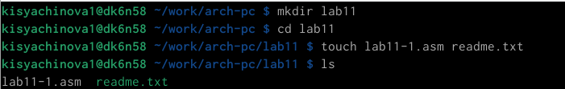{ #fig:001 width=70% }

2. Открываем файл и вводим текст программы. Создаём исполняемый файл и проверяем его работу. (рис. [-@fig:002]), (рис. [-@fig:003]), (рис. [-@fig:004])

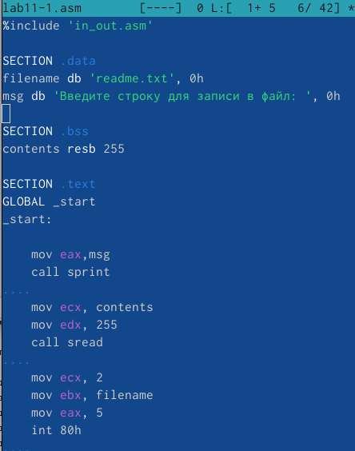{ #fig:002 width=40% }

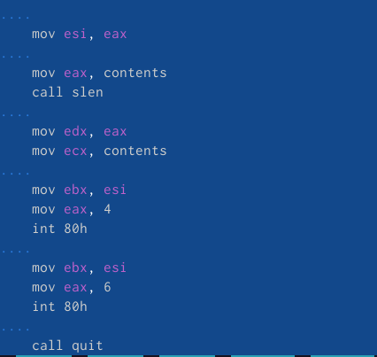{ #fig:003 width=40% }

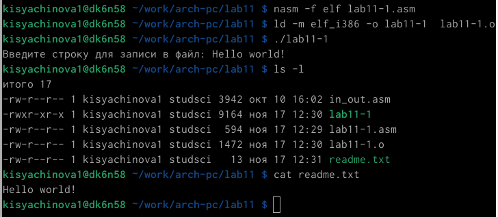{ #fig:004 width=70% }

3. С помощью команды 'chmod' изменяем права доступа к исполняемому файлу lab11-1. Запрещаем его выполнение для всех (права владельца, права группы и права остальных. Мы можем заметить, что произошла обишка: отказано в доступе. Это произошло, потому что мы запретили выполнение этого файла, тем самым ограничив в правах доступа к нему. (рис. [-@fig:005])

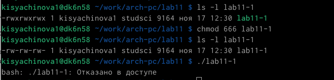{ #fig:005 width=70% }

4. Теперь с помощью той же комнады попытаемся изменить права доступа к файлу lab11-2.asm. с исходным текстом программы. Файл стал успешно исполняемым, но после его запуска произошли ошибки. Так вышло, потому что каждую строчку нашей программы компьютер попытался выполнить в терменале. Обшибки обосновываются тем, что команды не найдены, эти строки непонятны для терминала. (рис. [-@fig:006])

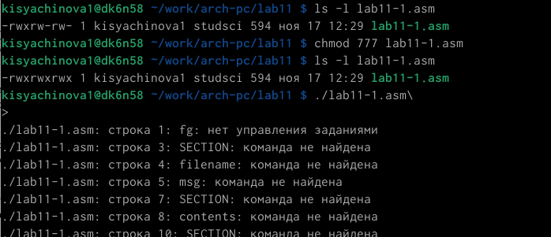{ #fig:006 width=70% }

5. Предоставим права доступа к файлу 'readme.txt' в соответствии с вариантом 11. А именно в двоичной системе имеется вид 000 100 111.(рис. [-@fig:007])

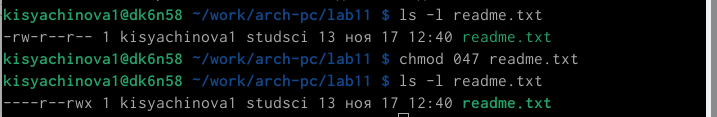{ #fig:007 width=70% }

В символьном виде имее --x r-- -w-. [-@fig:008])

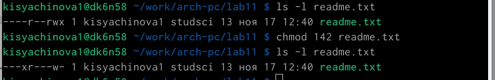{ #fig:008 width=70% }

# Самтостоятельная работа

Напшием программу, которая работает по следующему алгоритму

- Вывод приглашения “Как Вас зовут?”
- Ввести с клавиатуры свои фамилию и имя
- Создать файл с именем name.txt
- Записать в файл сообщение “Меня зовут”
- Дописать в файл строку введенную с клавиатуры
- Закрыть файл

Для этого создаём файл lab11-2.asm для текста прогарммы и файл name.txt.[-@fig:009])

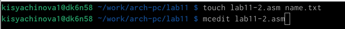{ #fig:009 width=70% }

Открываем файл и пишем текст программы. [-@fig:010])

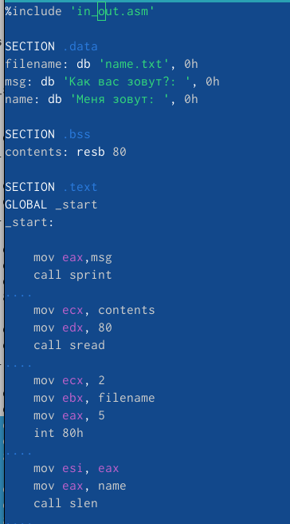{ #fig:010 width=40% }

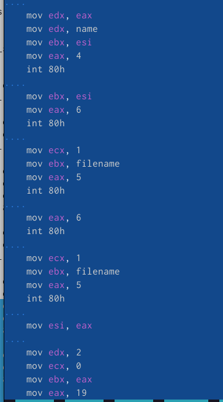{ #fig:011 width=40% }

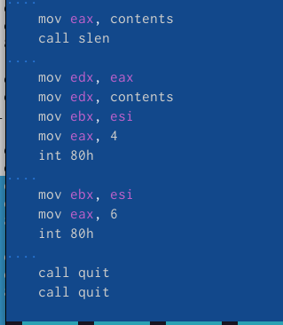{ #fig:012 width=40% }

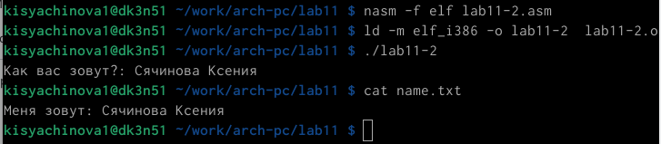{ #fig:013 width=70% }

# Выводы

В ходе выполнения данной лаболраторной работы я преобрела навыки написания программ для работы с файлами.
